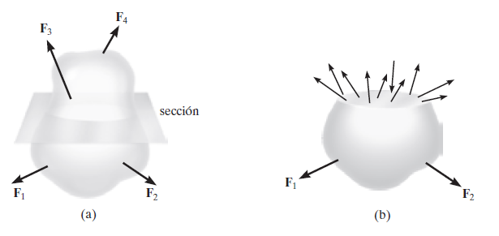
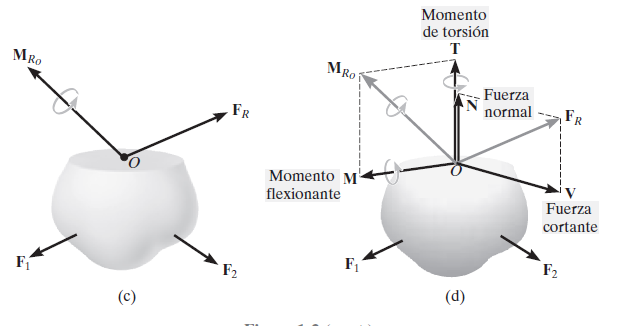

---
title: "1.0. Introducción"
author: "César Manrique"
date: "2022-03-23"
geometry: margin=2cm
#-- keywords: []
...

**Esfuerzo**
===

La estática desempeña un papel importante en el desarrollo de resistencia de materiales.
Para ello utilizamos las ecuaciones de equilibrio.
$$\sum{F_x}=0, ~~ \sum{F_y}=0, ~~ \sum{M_o}=0$$

### **Tabla de contenidos**

- [**Esfuerzo**](#esfuerzo)
- [**Esfuerzos en los elementos de una estructura**](#esfuerzos-en-los-elementos-de-una-estructura)
- [**Unidades**](#unidades-sigma)
- 

Resistencia rigidez estabilidad plasticidad

## **Esfuerzo**
+ Esfuerzo Axial
    $$\sigma = \frac{F}{A}$$
    - Compresión
    $$\Longrightarrow|\qquad|\Longleftarrow$$
    - Tracción
    $$\Longleftarrow|\qquad|\Longrightarrow$$

+ Esfuerzo Cortante
    <!-- temporal -->
    $$\tau = \frac{F}{A}$$

## **Esfuerzos en los elementos de una estructura**

||Dimensión|Unidad|Descripción|
|:-|:-|:-|:-|
|_a_|Esfuerzo axial|$N$|Actúa perpendicular a la sección tranversal.|
|_b_|Esfuerzo cortante|$V$|Actúa de forma paralela a la sección tranversal.|
|_c_|Momento de torsión|$T$|Sucede cuando una carga tuerce en relación a uno de los ejes de la carga|
|_d_|Momento flexionante|$M$|Es causado por cargas externas respecto al punto donde convergen el área de aplicación y uno de los ejes.|

## **Unidades $\sigma$**
+ $\sigma, \tau =$ Fuerza axial, Fuerza cortante

+ Sistema internacional (SI):
    $$ \begin{align*}
    1 \ Pa &= 1 \ N/m^2\\
    1 \ kPa &= 10^3 \ N/m^2 = 1 \ N/mm^2 \\
    1 \ mPa &= 10^6 \ N/m^2 = 1 \ N/mm^2 \\
    1 \ gPa &= 10^9 \ N/m^2 = 1 \ kN/mm^2 \\
    \end{align*} $$

+ Sistema Inglés:
    $$ \begin{align*}
    1 \ psi &= 1 \ libra/pulg^2\\
    1 \ ksi &= 10^3 \ libra/pulg^2
    \end{align*} $$